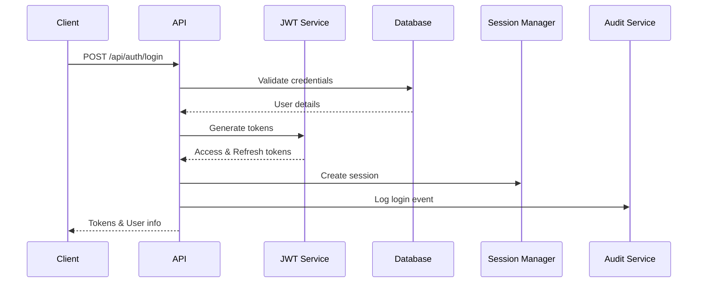

# Authentication and Authorization Guide

## Table of Contents
1. [Overview](#overview)
2. [Authentication Flow](#authentication-flow)
3. [Authorization System](#authorization-system)
4. [Token Management](#token-management)
5. [Multi-Factor Authentication](#multi-factor-authentication)
6. [OAuth 2.0 Scopes](#oauth-20-scopes)
7. [Session Management](#session-management)
8. [Security Best Practices](#security-best-practices)
9. [Implementation Examples](#implementation-examples)

## Overview

The OmniCare Clinical Workflow System implements a robust, HIPAA-compliant authentication and authorization system featuring:

- **JWT-based authentication** with access and refresh tokens
- **Role-Based Access Control (RBAC)** with hierarchical permissions
- **Multi-Factor Authentication (MFA)** for high-privilege users
- **OAuth 2.0 scope-based authorization** for fine-grained access control
- **Session management** with security validation
- **Audit logging** for all authentication events

## Authentication Flow

### 1. Login Process



**Login Request:**
```http
POST /api/auth/login
Content-Type: application/json

{
  "username": "dr.smith",
  "password": "SecurePass123!",
  "mfaToken": "123456"  // Required for MFA-enabled accounts
}
```

**Login Response:**
```json
{
  "success": true,
  "accessToken": "eyJhbGciOiJIUzI1NiIs...",
  "refreshToken": "eyJhbGciOiJIUzI1NiIs...",
  "user": {
    "id": "user-123",
    "username": "dr.smith",
    "email": "dr.smith@hospital.com",
    "role": "physician",
    "permissions": ["view_patient_records", "create_clinical_notes", ...],
    "department": "Cardiology",
    "profile": {
      "firstName": "John",
      "lastName": "Smith",
      "licenseNumber": "MD123456"
    }
  },
  "sessionId": "session-abc-123",
  "expiresIn": 900  // 15 minutes
}
```

### 2. Token Structure

**Access Token Payload:**
```json
{
  "userId": "user-123",
  "username": "dr.smith",
  "role": "physician",
  "permissions": [
    "view_patient_records",
    "create_clinical_notes",
    "create_prescriptions"
  ],
  "sessionId": "session-abc-123",
  "iat": 1704985200,
  "exp": 1704986100,
  "iss": "omnicare-emr",
  "aud": "omnicare-app"
}
```

### 3. Token Refresh Process

```http
POST /api/auth/refresh
Content-Type: application/json

{
  "refreshToken": "eyJhbGciOiJIUzI1NiIs..."
}
```

**Response:**
```json
{
  "success": true,
  "accessToken": "eyJhbGciOiJIUzI1NiIs...",
  "expiresIn": 900
}
```

## Authorization System

### User Roles

The system implements a hierarchical role-based access control system:

| Role | Code | Hierarchy Level | Description |
|------|------|----------------|-------------|
| System Administrator | `system_admin` | 6 | Full system access |
| Physician | `physician` | 5 | Clinical documentation and prescriptions |
| Nurse | `nurse` | 4 | Patient care and documentation |
| Pharmacist | `pharmacist` | 3 | Medication management |
| Medical Assistant | `medical_assistant` | 2 | Basic patient care tasks |
| Administrative Staff | `admin_staff` | 1 | Non-clinical administrative tasks |
| Patient | `patient` | 0 | View own records only |

### Permission Categories

**1. Clinical Documentation**
- `create_clinical_notes` - Create new clinical notes
- `edit_clinical_notes` - Edit existing clinical notes
- `view_clinical_notes` - View clinical notes
- `finalize_clinical_notes` - Lock notes from further editing

**2. Prescription Management**
- `create_prescriptions` - Write new prescriptions
- `modify_prescriptions` - Modify existing prescriptions
- `view_prescriptions` - View prescription history
- `verify_prescriptions` - Pharmacist verification
- `dispense_medications` - Mark medications as dispensed

**3. Patient Management**
- `view_patient_records` - Access patient medical records
- `edit_patient_records` - Modify patient medical information
- `create_patient_records` - Register new patients
- `view_patient_demographics` - View basic patient information
- `edit_patient_demographics` - Update patient demographics

**4. Task Management**
- `Task:read` - View clinical tasks
- `Task:write` - Create and modify tasks
- `user/*.read` - General read access
- `user/*.write` - General write access

### Role-Permission Matrix

| Permission | Admin | Physician | Nurse | Pharmacist | MA | Staff | Patient |
|------------|-------|-----------|-------|------------|-----|-------|---------|
| System Settings | ✓ | - | - | - | - | - | - |
| Create Clinical Notes | ✓ | ✓ | ✓ | - | - | - | - |
| Edit Clinical Notes | ✓ | ✓ | ✓* | - | - | - | - |
| View Clinical Notes | ✓ | ✓ | ✓ | ✓ | ✓ | - | ✓** |
| Create Prescriptions | ✓ | ✓ | - | - | - | - | - |
| Verify Prescriptions | ✓ | - | - | ✓ | - | - | - |
| Manage Tasks | ✓ | ✓ | ✓ | ✓ | ✓ | - | - |
| View Patient Records | ✓ | ✓ | ✓ | ✓ | ✓ | ✓* | ✓** |

*Limited to assigned patients
**Own records only

## Token Management

### Token Lifecycle

1. **Access Token**: Short-lived (15 minutes)
   - Used for API requests
   - Contains user identity and permissions
   - Stateless validation

2. **Refresh Token**: Long-lived (7 days)
   - Used to obtain new access tokens
   - Stored securely on client
   - Can be revoked server-side

### Token Validation

```javascript
// Middleware example
async function authenticateToken(req, res, next) {
  const authHeader = req.headers['authorization'];
  const token = authHeader && authHeader.split(' ')[1];
  
  if (!token) {
    return res.status(401).json({
      error: 'MISSING_AUTHORIZATION',
      message: 'Authorization header required'
    });
  }
  
  try {
    const payload = jwt.verify(token, process.env.JWT_ACCESS_SECRET);
    
    // Validate session
    const session = await sessionManager.getSession(payload.sessionId);
    if (!session || !session.isActive) {
      throw new Error('Invalid or expired session');
    }
    
    req.user = payload;
    next();
  } catch (error) {
    return res.status(403).json({
      error: 'INVALID_TOKEN',
      message: 'Invalid or expired token'
    });
  }
}
```

### Token Storage Best Practices

**Client-Side Storage:**
- **Access Token**: Store in memory or sessionStorage
- **Refresh Token**: Store in httpOnly secure cookie or secure storage
- **Never store tokens in localStorage** for production

**Token Transmission:**
```javascript
// Always use Authorization header
const headers = {
  'Authorization': `Bearer ${accessToken}`,
  'Content-Type': 'application/json'
};
```

## Multi-Factor Authentication

### MFA Requirements

MFA is mandatory for the following roles:
- System Administrators
- Physicians
- Any user handling PHI (Protected Health Information)

### MFA Setup Flow

1. **Generate MFA Secret**
```http
POST /api/auth/mfa/setup
Authorization: Bearer <token>
```

**Response:**
```json
{
  "secret": "JBSWY3DPEHPK3PXP",
  "qrCode": "data:image/png;base64,iVBORw0KGgo...",
  "backupCodes": [
    "a1b2c3d4e5",
    "f6g7h8i9j0",
    ...
  ]
}
```

2. **Verify MFA Setup**
```http
POST /api/auth/mfa/verify
Authorization: Bearer <token>
Content-Type: application/json

{
  "token": "123456"
}
```

3. **MFA Login**
```http
POST /api/auth/login
Content-Type: application/json

{
  "username": "dr.smith",
  "password": "SecurePass123!",
  "mfaToken": "123456"
}
```

### Backup Codes

- 10 single-use backup codes generated during MFA setup
- Stored encrypted in database
- Can be regenerated by administrators

## OAuth 2.0 Scopes

The system supports OAuth 2.0 scopes for fine-grained access control:

### Available Scopes

**FHIR Resource Scopes:**
- `Patient.read` - Read patient resources
- `Patient.write` - Write patient resources
- `Observation.read` - Read observations
- `Observation.write` - Write observations
- `MedicationRequest.*` - All medication request operations
- `Task.read` - Read clinical tasks
- `Task.write` - Create/update clinical tasks

**Custom Scopes:**
- `clinical_notes.read` - View clinical documentation
- `clinical_notes.write` - Create/edit clinical documentation
- `prescriptions.write` - Create prescriptions
- `admin.all` - Administrative operations

### Scope Usage Example

```http
POST /api/oauth/token
Content-Type: application/x-www-form-urlencoded

grant_type=client_credentials&
client_id=clinical_app_123&
client_secret=secret&
scope=Patient.read Task.write clinical_notes.read
```

## Session Management

### Session Security Features

1. **IP Address Validation**
   - Sessions tied to originating IP
   - Configurable IP change tolerance

2. **User Agent Validation**
   - Detect session hijacking attempts
   - Alert on suspicious changes

3. **Concurrent Session Control**
   - Limit sessions per user
   - Force logout of oldest sessions

4. **Idle Timeout**
   - 15-minute idle timeout
   - Automatic session cleanup

### Session API

**Get Active Sessions:**
```http
GET /api/auth/sessions
Authorization: Bearer <token>
```

**Response:**
```json
{
  "sessions": [
    {
      "id": "session-abc-123",
      "deviceInfo": {
        "userAgent": "Mozilla/5.0...",
        "ip": "192.168.1.100"
      },
      "createdAt": "2024-01-10T10:00:00Z",
      "lastActivity": "2024-01-10T10:30:00Z",
      "isCurrent": true
    }
  ]
}
```

**Terminate Session:**
```http
DELETE /api/auth/sessions/{sessionId}
Authorization: Bearer <token>
```

## Security Best Practices

### 1. Password Requirements

```javascript
const passwordPolicy = {
  minLength: 8,
  requireUppercase: true,
  requireLowercase: true,
  requireNumbers: true,
  requireSpecialChars: true,
  preventCommonPasswords: true,
  preventUserInfoInPassword: true
};
```

### 2. Account Lockout Policy

- 5 failed login attempts trigger temporary lockout
- Lockout duration: 15 minutes
- Progressive lockout for repeated failures

### 3. Audit Logging

All authentication events are logged:
```json
{
  "eventType": "LOGIN_SUCCESS",
  "userId": "user-123",
  "username": "dr.smith",
  "ipAddress": "192.168.1.100",
  "userAgent": "Mozilla/5.0...",
  "timestamp": "2024-01-10T10:00:00Z",
  "sessionId": "session-abc-123",
  "metadata": {
    "mfaUsed": true,
    "loginMethod": "password"
  }
}
```

### 4. Security Headers

Ensure these headers are set for all authenticated endpoints:
```javascript
app.use((req, res, next) => {
  res.setHeader('X-Content-Type-Options', 'nosniff');
  res.setHeader('X-Frame-Options', 'DENY');
  res.setHeader('X-XSS-Protection', '1; mode=block');
  res.setHeader('Strict-Transport-Security', 'max-age=31536000; includeSubDomains');
  res.setHeader('Content-Security-Policy', "default-src 'self'");
  next();
});
```

## Implementation Examples

### 1. React Authentication Hook

```typescript
import { useState, useEffect, useCallback } from 'react';
import axios from 'axios';

interface AuthState {
  user: User | null;
  isAuthenticated: boolean;
  isLoading: boolean;
  error: string | null;
}

export function useAuth() {
  const [authState, setAuthState] = useState<AuthState>({
    user: null,
    isAuthenticated: false,
    isLoading: true,
    error: null
  });

  const login = useCallback(async (username: string, password: string, mfaToken?: string) => {
    try {
      const response = await axios.post('/api/auth/login', {
        username,
        password,
        mfaToken
      });
      
      const { accessToken, refreshToken, user } = response.data;
      
      // Store tokens securely
      sessionStorage.setItem('accessToken', accessToken);
      // Store refresh token in httpOnly cookie via API
      
      setAuthState({
        user,
        isAuthenticated: true,
        isLoading: false,
        error: null
      });
      
      // Setup token refresh
      setupTokenRefresh(refreshToken);
      
      return { success: true };
    } catch (error) {
      setAuthState({
        user: null,
        isAuthenticated: false,
        isLoading: false,
        error: error.response?.data?.message || 'Login failed'
      });
      
      return { success: false, error: error.response?.data };
    }
  }, []);

  const logout = useCallback(async () => {
    try {
      await axios.post('/api/auth/logout');
      sessionStorage.removeItem('accessToken');
      
      setAuthState({
        user: null,
        isAuthenticated: false,
        isLoading: false,
        error: null
      });
    } catch (error) {
      console.error('Logout error:', error);
    }
  }, []);

  const checkPermission = useCallback((permission: string) => {
    return authState.user?.permissions?.includes(permission) || false;
  }, [authState.user]);

  const hasRole = useCallback((role: string) => {
    return authState.user?.role === role;
  }, [authState.user]);

  return {
    ...authState,
    login,
    logout,
    checkPermission,
    hasRole
  };
}
```

### 2. Axios Interceptor for Token Management

```typescript
import axios from 'axios';

// Request interceptor to add token
axios.interceptors.request.use(
  (config) => {
    const token = sessionStorage.getItem('accessToken');
    if (token) {
      config.headers.Authorization = `Bearer ${token}`;
    }
    return config;
  },
  (error) => Promise.reject(error)
);

// Response interceptor for token refresh
axios.interceptors.response.use(
  (response) => response,
  async (error) => {
    const originalRequest = error.config;
    
    if (error.response?.status === 401 && !originalRequest._retry) {
      originalRequest._retry = true;
      
      try {
        const response = await axios.post('/api/auth/refresh', {
          refreshToken: getRefreshToken()
        });
        
        const { accessToken } = response.data;
        sessionStorage.setItem('accessToken', accessToken);
        
        // Retry original request
        originalRequest.headers.Authorization = `Bearer ${accessToken}`;
        return axios(originalRequest);
      } catch (refreshError) {
        // Redirect to login
        window.location.href = '/login';
        return Promise.reject(refreshError);
      }
    }
    
    return Promise.reject(error);
  }
);
```

### 3. Protected Route Component

```typescript
import React from 'react';
import { Navigate } from 'react-router-dom';
import { useAuth } from './useAuth';

interface ProtectedRouteProps {
  children: React.ReactNode;
  requiredPermission?: string;
  requiredRole?: string;
}

export function ProtectedRoute({ 
  children, 
  requiredPermission, 
  requiredRole 
}: ProtectedRouteProps) {
  const { isAuthenticated, isLoading, checkPermission, hasRole } = useAuth();
  
  if (isLoading) {
    return <div>Loading...</div>;
  }
  
  if (!isAuthenticated) {
    return <Navigate to="/login" replace />;
  }
  
  if (requiredPermission && !checkPermission(requiredPermission)) {
    return <Navigate to="/unauthorized" replace />;
  }
  
  if (requiredRole && !hasRole(requiredRole)) {
    return <Navigate to="/unauthorized" replace />;
  }
  
  return <>{children}</>;
}

// Usage
<ProtectedRoute requiredPermission="create_clinical_notes">
  <ClinicalNotesEditor />
</ProtectedRoute>
```

### 4. Node.js Permission Middleware

```typescript
export function requirePermission(permission: string) {
  return (req: Request, res: Response, next: NextFunction) => {
    if (!req.user) {
      return res.status(401).json({
        error: 'UNAUTHORIZED',
        message: 'Authentication required'
      });
    }
    
    if (!req.user.permissions.includes(permission)) {
      return res.status(403).json({
        error: 'FORBIDDEN',
        message: `Missing required permission: ${permission}`
      });
    }
    
    next();
  };
}

// Usage
router.post('/api/clinical-notes',
  authenticateToken,
  requirePermission('create_clinical_notes'),
  createClinicalNote
);
```

### 5. Role-Based UI Components

```typescript
interface RoleGateProps {
  allowedRoles: string[];
  children: React.ReactNode;
  fallback?: React.ReactNode;
}

export function RoleGate({ allowedRoles, children, fallback }: RoleGateProps) {
  const { user } = useAuth();
  
  if (!user || !allowedRoles.includes(user.role)) {
    return fallback || null;
  }
  
  return <>{children}</>;
}

// Usage
<RoleGate allowedRoles={['physician', 'nurse']}>
  <Button onClick={createPrescription}>
    Create Prescription
  </Button>
</RoleGate>
```

## Troubleshooting

### Common Authentication Issues

1. **"Invalid Token" Error**
   - Check token expiration
   - Verify JWT secret configuration
   - Ensure proper token transmission

2. **"Session Expired" Error**
   - Session timeout reached
   - IP address changed
   - Session terminated by admin

3. **MFA Issues**
   - Time sync problems (ensure server time is accurate)
   - Incorrect MFA window configuration
   - Backup code already used

4. **CORS Errors**
   - Verify CORS configuration
   - Check allowed origins
   - Ensure credentials are included

### Debug Endpoints (Development Only)

```http
# Decode token (dev only)
POST /api/auth/debug/decode
Authorization: Bearer <token>

# Check permissions
GET /api/auth/debug/permissions
Authorization: Bearer <token>

# Validate session
GET /api/auth/debug/session/{sessionId}
Authorization: Bearer <token>
```

## Compliance Considerations

### HIPAA Requirements

1. **Access Controls**: Role-based access enforced at API level
2. **Audit Trails**: All authentication events logged
3. **Encryption**: Tokens encrypted in transit and at rest
4. **Session Management**: Automatic timeout for idle sessions
5. **Strong Authentication**: MFA for high-privilege users

### Security Certifications

The authentication system is designed to meet:
- HIPAA Security Rule requirements
- NIST 800-63B authentication guidelines
- OAuth 2.0 security best practices
- OWASP authentication standards

## Support

For authentication issues or questions:
- Review logs in `/var/log/omnicare/auth.log`
- Check session status at `/api/auth/sessions`
- Contact security team for MFA issues
- Submit tickets for permission changes