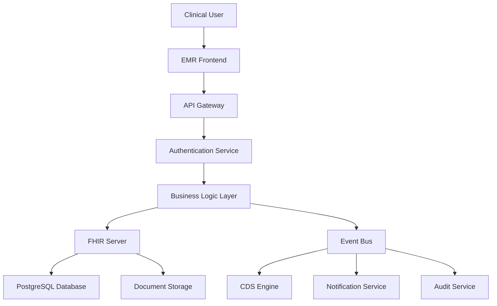

# OmniCare EMR System Architecture Specification

## Executive Summary

This document presents the comprehensive system architecture for OmniCare EMR, a next-generation clinical EMR system built on Medplum's FHIR-native architecture. The system is designed to integrate seamlessly with existing EHR platforms while focusing on clinical workflows and patient care excellence.

## 1. Architecture Overview

### 1.1 High-Level System Architecture

```
┌─────────────────────────────────────────────────────────────────┐
│                    OmniCare EMR Platform                        │
├─────────────────────────────────────────────────────────────────┤
│  Presentation Layer                                             │
│  ├─ Web Application (React 18+ / Next.js 14)                   │
│  ├─ Mobile Apps (React Native - iOS/Android)                   │
│  └─ Patient Portal (Progressive Web App)                       │
├─────────────────────────────────────────────────────────────────┤
│  API Gateway & Security Layer                                   │
│  ├─ SMART on FHIR Integration                                  │
│  ├─ OAuth 2.0 / OpenID Connect                                │
│  ├─ Role-Based Access Control (RBAC)                          │
│  └─ API Rate Limiting & Throttling                            │
├─────────────────────────────────────────────────────────────────┤
│  Business Logic & Orchestration Layer                          │
│  ├─ Clinical Decision Support Engine                           │
│  ├─ Business Rules Engine                                      │
│  ├─ Workflow Orchestration Service                             │
│  ├─ Event Processing (Apache Kafka)                           │
│  └─ Notification Service                                       │
├─────────────────────────────────────────────────────────────────┤
│  Data Layer                                                     │
│  ├─ Medplum FHIR Server (PostgreSQL)                          │
│  ├─ Document Storage (AWS S3 / Azure Blob)                    │
│  ├─ Audit & Compliance Database                               │
│  ├─ Cache Layer (Redis Cluster)                               │
│  └─ Search Engine (Elasticsearch)                             │
├─────────────────────────────────────────────────────────────────┤
│  External Integrations                                          │
│  ├─ EHR Systems (SMART on FHIR)                               │
│  ├─ Laboratory Systems (HL7 v2/FHIR)                          │
│  ├─ Pharmacy Systems (NCPDP/FHIR)                             │
│  ├─ PACS/Imaging Systems (DICOM/FHIR)                         │
│  └─ External APIs & Services                                  │
└─────────────────────────────────────────────────────────────────┘
```

### 1.2 Architecture Principles

- **FHIR-Native**: All clinical data stored and managed using FHIR R4 standards
- **Microservices Architecture**: Modular, domain-driven service design
- **API-First Design**: Comprehensive RESTful APIs with OpenAPI documentation
- **Event-Driven Processing**: Asynchronous messaging for real-time updates
- **Cloud-Native Deployment**: Containerized services with Kubernetes orchestration
- **Security by Design**: Zero-trust architecture with comprehensive audit trails
- **Mobile-First UX**: Responsive design optimized for mobile devices
- **Interoperability**: Standards-based integration with existing healthcare systems

## 2. Technology Stack

### 2.1 Frontend Technologies

**Core Framework Stack:**
- **React 18.2+**: Modern React with concurrent features and Suspense
- **Next.js 14**: App Router, Server Components, and Edge Runtime
- **TypeScript 5.x**: Type-safe development with advanced type features
- **Tailwind CSS 3.x**: Utility-first CSS framework for rapid UI development
- **Shadcn/UI + Radix UI**: Accessible, customizable component library

**State Management:**
- **TanStack Query**: Server state management with intelligent caching
- **Zustand**: Lightweight client state management
- **React Hook Form**: Performant form handling with validation

**UI Components:**
- **Medplum Components**: 120+ healthcare-specific React components
- **Phosphor Icons**: Consistent icon library with multiple weights
- **Healthicons**: Healthcare-specific icons for medical concepts

**Mobile Stack:**
- **React Native 0.72+**: Cross-platform mobile development
- **@medplum/react-native**: Native healthcare components
- **Expo SDK**: Development tools and native API access
- **React Navigation**: Type-safe navigation for mobile apps

### 2.2 Backend Technologies

**Core Infrastructure:**
- **Medplum Server**: FHIR R4 compliant server with built-in authentication
- **Node.js 18+**: Runtime environment with ES modules support
- **NestJS**: Scalable Node.js framework with TypeScript support
- **PostgreSQL 15**: Primary database with JSONB support for FHIR resources

**API & Integration:**
- **GraphQL**: Efficient data fetching with Apollo Server
- **REST APIs**: RESTful endpoints following FHIR standards
- **SMART on FHIR**: Healthcare interoperability standard
- **OAuth 2.0/OpenID Connect**: Authentication and authorization

**Message Processing:**
- **Apache Kafka**: Distributed event streaming platform
- **Redis**: In-memory data structure store for caching
- **WebSocket**: Real-time communication for live updates

### 2.3 Infrastructure & DevOps

**Containerization & Orchestration:**
- **Docker**: Container platform for consistent deployments
- **Kubernetes**: Container orchestration with auto-scaling
- **Helm**: Package manager for Kubernetes applications

**Cloud Platforms:**
- **AWS/Azure**: Multi-cloud deployment capability
- **Terraform**: Infrastructure as Code for cloud resources
- **GitHub Actions**: CI/CD pipeline automation

**Monitoring & Observability:**
- **Prometheus**: Metrics collection and alerting
- **Grafana**: Visualization and dashboards
- **Jaeger**: Distributed tracing for microservices
- **ELK Stack**: Centralized logging and search

## 3. Core Module Architecture

### 3.1 Clinical Modules

**Patient Chart Module:**
```typescript
interface PatientChartModule {
  components: {
    patientTimeline: 'Comprehensive patient history with events';
    patientSummary: 'Condensed patient demographics and key info';
    patientHeader: 'Consistent patient context across views';
    problemList: 'Active and resolved patient problems';
    medicationList: 'Current and historical medications';
    allergyList: 'Known allergies and intolerances';
  };
  
  features: {
    timelineView: 'Chronological patient history';
    summaryDashboard: 'Clinical snapshot with key metrics';
    flowsheetView: 'Tabular data presentation';
    searchCapabilities: 'Advanced patient search';
  };
  
  dependencies: ['fhir-client', 'auth-service', 'search-service'];
}
```

**Clinical Documentation Module:**
```typescript
interface ClinicalDocumentationModule {
  components: {
    smartText: 'AI-powered clinical concept detection';
    questionnaireForm: 'Dynamic form rendering from FHIR';
    clinicalImpressionForm: 'Structured clinical assessments';
    noteInput: 'Rich text editor with templates';
    questionnaireBuilder: 'Visual questionnaire designer';
  };
  
  features: {
    templateEngine: 'Customizable documentation templates';
    voiceToText: 'Speech recognition for clinical documentation';
    conceptDetection: 'Automatic SNOMED/ICD coding';
    collaborativeEditing: 'Real-time collaborative documentation';
  };
  
  dependencies: ['nlp-service', 'template-engine', 'voice-service'];
}
```

**Order Management Module:**
```typescript
interface OrderManagementModule {
  components: {
    serviceRequestForm: 'Lab, imaging, and procedure ordering';
    medicationRequestForm: 'E-prescribing interface';
    taskList: 'Clinical task management';
    requestGroupForm: 'Order sets and care protocols';
  };
  
  features: {
    cpoe: 'Computerized Provider Order Entry';
    orderSets: 'Standardized order collections';
    clinicalDecisionSupport: 'Real-time ordering guidance';
    workflowIntegration: 'Seamless order-to-result workflow';
  };
  
  dependencies: ['cds-engine', 'drug-database', 'lab-interfaces'];
}
```

### 3.2 Administrative Modules

**Patient Registration Module:**
```typescript
interface PatientRegistrationModule {
  features: {
    demographicCapture: 'Comprehensive patient demographics';
    insuranceVerification: 'Real-time eligibility checking';
    documentScanning: 'Digital document capture and storage';
    duplicateDetection: 'Intelligent duplicate patient detection';
  };
  
  dependencies: ['identity-service', 'insurance-service', 'document-service'];
}
```

**Appointment Management Module:**
```typescript
interface AppointmentManagementModule {
  features: {
    scheduling: 'Multi-provider scheduling with conflict detection';
    resourceManagement: 'Room and equipment allocation';
    reminderSystem: 'Automated patient reminders';
    waitlistManagement: 'Intelligent wait list handling';
  };
  
  dependencies: ['calendar-service', 'notification-service', 'resource-service'];
}
```

## 4. Data Architecture

### 4.1 FHIR Resource Design

**Core Clinical Resources:**
```typescript
interface FHIRResourceArchitecture {
  patient: {
    resource: 'Patient';
    purpose: 'Demographics and identifiers';
    relationships: ['Encounter', 'Observation', 'Condition'];
  };
  
  encounter: {
    resource: 'Encounter';
    purpose: 'Clinical visits and episodes';
    relationships: ['Patient', 'Practitioner', 'Location'];
  };
  
  observation: {
    resource: 'Observation';
    purpose: 'Vital signs, lab results, assessments';
    relationships: ['Patient', 'Encounter', 'Practitioner'];
  };
  
  condition: {
    resource: 'Condition';
    purpose: 'Diagnoses and problem lists';
    relationships: ['Patient', 'Encounter', 'Practitioner'];
  };
  
  medicationRequest: {
    resource: 'MedicationRequest';
    purpose: 'Prescription orders and requests';
    relationships: ['Patient', 'Practitioner', 'Medication'];
  };
}
```

### 4.2 Database Schema Design

**Audit and Compliance Tables:**
```sql
-- Comprehensive audit logging
CREATE TABLE audit_log (
    id UUID PRIMARY KEY DEFAULT gen_random_uuid(),
    timestamp TIMESTAMPTZ NOT NULL DEFAULT NOW(),
    user_id VARCHAR(255) NOT NULL,
    patient_id VARCHAR(255),
    resource_type VARCHAR(100),
    resource_id VARCHAR(255),
    action VARCHAR(50) NOT NULL,
    ip_address INET,
    user_agent TEXT,
    session_id VARCHAR(255),
    details JSONB,
    created_at TIMESTAMPTZ DEFAULT NOW()
);

-- Security event tracking
CREATE TABLE security_events (
    id UUID PRIMARY KEY DEFAULT gen_random_uuid(),
    timestamp TIMESTAMPTZ NOT NULL DEFAULT NOW(),
    event_type VARCHAR(100) NOT NULL,
    severity VARCHAR(20) NOT NULL,
    user_id VARCHAR(255),
    source_ip INET,
    details JSONB,
    resolved BOOLEAN DEFAULT FALSE,
    resolved_at TIMESTAMPTZ,
    resolved_by VARCHAR(255)
);

-- User session management
CREATE TABLE user_sessions (
    id UUID PRIMARY KEY DEFAULT gen_random_uuid(),
    user_id VARCHAR(255) NOT NULL,
    session_token VARCHAR(255) UNIQUE NOT NULL,
    expires_at TIMESTAMPTZ NOT NULL,
    last_activity TIMESTAMPTZ DEFAULT NOW(),
    ip_address INET,
    user_agent TEXT,
    created_at TIMESTAMPTZ DEFAULT NOW()
);
```

### 4.3 Data Flow Architecture

**Clinical Data Flow:**


## 5. Security Architecture

### 5.1 Authentication & Authorization

**SMART on FHIR Integration:**
```typescript
interface SMARTonFHIRFlow {
  discovery: {
    endpoint: '/.well-known/smart_configuration';
    capabilities: ['launch-ehr', 'launch-standalone', 'client-public'];
  };
  
  authorization: {
    endpoint: '/oauth/authorize';
    scopes: ['patient/read', 'user/read', 'launch/patient'];
    responseType: 'code';
  };
  
  token: {
    endpoint: '/oauth/token';
    grantType: 'authorization_code';
    tokenType: 'Bearer';
  };
}
```

**Role-Based Access Control:**
```typescript
interface RBACConfiguration {
  roles: {
    physician: {
      permissions: ['patient:read', 'patient:write', 'medication:prescribe'];
      restrictions: [];
    };
    nurse: {
      permissions: ['patient:read', 'patient:write', 'medication:administer'];
      restrictions: ['medication:prescribe'];
    };
    administrator: {
      permissions: ['system:admin', 'user:manage', 'reports:generate'];
      restrictions: ['patient:clinical'];
    };
  };
  
  contextualAccess: {
    patientSpecific: 'Users can only access assigned patients';
    locationBased: 'Access restricted by facility/department';
    timeBased: 'Access limited to scheduled work hours';
  };
}
```

### 5.2 Data Protection

**Encryption Standards:**
```typescript
interface DataProtection {
  encryption: {
    atRest: 'AES-256-GCM with managed keys';
    inTransit: 'TLS 1.3 with perfect forward secrecy';
    application: 'Field-level encryption for PHI';
  };
  
  keyManagement: {
    provider: 'AWS KMS / Azure Key Vault';
    rotation: 'Automatic key rotation every 90 days';
    access: 'Role-based key access with audit trails';
  };
  
  dataClassification: {
    phi: 'Protected Health Information - highest security';
    pii: 'Personally Identifiable Information - high security';
    clinical: 'Clinical data - medium security';
    administrative: 'Administrative data - standard security';
  };
}
```

## 6. Integration Architecture

### 6.1 EHR Integration

**SMART on FHIR Launch Sequence:**
```typescript
interface EHRIntegration {
  launchTypes: {
    ehrLaunch: 'Launched from within EHR context';
    standaloneLaunch: 'Independent application launch';
    patientLaunch: 'Patient-facing application launch';
  };
  
  contextSharing: {
    patient: 'Shared patient context across applications';
    encounter: 'Shared encounter information';
    user: 'Shared user authentication and profile';
    location: 'Shared facility/department context';
  };
  
  dataSync: {
    method: 'Bidirectional FHIR synchronization';
    frequency: 'Real-time via webhooks and subscriptions';
    conflictResolution: 'Last-writer-wins with audit trail';
  };
}
```

### 6.2 Laboratory Integration

**HL7 v2 and FHIR Integration:**
```typescript
interface LaboratoryIntegration {
  hl7v2: {
    orderMessages: 'ORM^O01 - Order messages';
    resultMessages: 'ORU^R01 - Result messages';
    transport: 'MLLP over TCP/IP with SSL';
    transformation: 'HL7 to FHIR mapping engine';
  };
  
  fhirBased: {
    orders: 'ServiceRequest resources for lab orders';
    results: 'Observation and DiagnosticReport resources';
    workflow: 'Task-based workflow management';
    subscriptions: 'Real-time result notifications';
  };
  
  criticalValues: {
    detection: 'Automated critical value identification';
    notification: 'Immediate provider notification';
    escalation: 'Automated escalation procedures';
    acknowledgment: 'Required provider acknowledgment';
  };
}
```

## 7. Deployment Architecture

### 7.1 Containerization Strategy

**Docker Configuration:**
```dockerfile
# Multi-stage build for frontend
FROM node:18-alpine AS builder
WORKDIR /app
COPY package*.json ./
RUN npm ci --only=production
COPY . .
RUN npm run build

FROM node:18-alpine AS runner
WORKDIR /app
COPY --from=builder /app/dist ./dist
COPY --from=builder /app/node_modules ./node_modules
EXPOSE 3000
CMD ["npm", "start"]
```

**Kubernetes Deployment:**
```yaml
apiVersion: apps/v1
kind: Deployment
metadata:
  name: omnicare-frontend
  namespace: omnicare
spec:
  replicas: 3
  selector:
    matchLabels:
      app: omnicare-frontend
  template:
    metadata:
      labels:
        app: omnicare-frontend
    spec:
      containers:
      - name: frontend
        image: omnicare/frontend:latest
        ports:
        - containerPort: 3000
        env:
        - name: API_URL
          valueFrom:
            configMapKeyRef:
              name: omnicare-config
              key: api-url
        resources:
          requests:
            memory: "256Mi"
            cpu: "250m"
          limits:
            memory: "512Mi"
            cpu: "500m"
        livenessProbe:
          httpGet:
            path: /health
            port: 3000
          initialDelaySeconds: 30
          periodSeconds: 10
        readinessProbe:
          httpGet:
            path: /ready
            port: 3000
          initialDelaySeconds: 5
          periodSeconds: 5
```

### 7.2 High Availability Configuration

**Load Balancing and Scaling:**
```yaml
apiVersion: v1
kind: Service
metadata:
  name: omnicare-frontend-service
spec:
  selector:
    app: omnicare-frontend
  ports:
  - port: 80
    targetPort: 3000
  type: LoadBalancer

---
apiVersion: autoscaling/v2
kind: HorizontalPodAutoscaler
metadata:
  name: omnicare-frontend-hpa
spec:
  scaleTargetRef:
    apiVersion: apps/v1
    kind: Deployment
    name: omnicare-frontend
  minReplicas: 3
  maxReplicas: 10
  metrics:
  - type: Resource
    resource:
      name: cpu
      target:
        type: Utilization
        averageUtilization: 70
  - type: Resource
    resource:
      name: memory
      target:
        type: Utilization
        averageUtilization: 80
```

## 8. Performance Optimization

### 8.1 Frontend Performance

**Code Splitting and Lazy Loading:**
```typescript
// Route-based code splitting
const PatientChart = lazy(() => import('./components/PatientChart'));
const ClinicalDocumentation = lazy(() => import('./components/ClinicalDocumentation'));
const OrderManagement = lazy(() => import('./components/OrderManagement'));

// Component-based lazy loading
const LazyObservationGraph = lazy(() => 
  import('@medplum/react').then(module => ({ 
    default: module.ObservationGraph 
  }))
);

// Preloading critical resources
const preloadCriticalResources = () => {
  const link = document.createElement('link');
  link.rel = 'preload';
  link.href = '/api/patient/current';
  link.as = 'fetch';
  document.head.appendChild(link);
};
```

**Caching Strategy:**
```typescript
// React Query configuration
const queryClient = new QueryClient({
  defaultOptions: {
    queries: {
      staleTime: 5 * 60 * 1000, // 5 minutes
      cacheTime: 10 * 60 * 1000, // 10 minutes
      retry: 3,
      retryDelay: attemptIndex => Math.min(1000 * 2 ** attemptIndex, 30000),
    },
  },
});

// Service Worker for offline caching
self.addEventListener('fetch', event => {
  if (event.request.url.includes('/api/patients')) {
    event.respondWith(
      caches.open('patient-data').then(cache => {
        return cache.match(event.request).then(response => {
          return response || fetch(event.request).then(fetchResponse => {
            cache.put(event.request, fetchResponse.clone());
            return fetchResponse;
          });
        });
      })
    );
  }
});
```

### 8.2 Backend Performance

**Database Optimization:**
```sql
-- Optimized indexes for common queries
CREATE INDEX CONCURRENTLY idx_patient_identifier 
ON patient USING btree (identifier);

CREATE INDEX CONCURRENTLY idx_observation_patient_date 
ON observation USING btree (patient_id, effective_date_time DESC);

CREATE INDEX CONCURRENTLY idx_medication_request_patient_status 
ON medication_request USING btree (patient_id, status);

-- Partial indexes for active records
CREATE INDEX CONCURRENTLY idx_active_appointments 
ON appointment (patient_id, start_time) 
WHERE status = 'active';
```

**API Response Optimization:**
```typescript
// GraphQL resolvers with DataLoader
const patientLoader = new DataLoader(async (patientIds: string[]) => {
  const patients = await Patient.findByIds(patientIds);
  return patientIds.map(id => patients.find(p => p.id === id));
});

// Efficient FHIR bundle responses
const createPatientBundle = async (patientId: string): Promise<Bundle> => {
  const [patient, encounters, observations] = await Promise.all([
    medplum.readResource('Patient', patientId),
    medplum.search('Encounter', { patient: patientId, _count: 10 }),
    medplum.search('Observation', { patient: patientId, _count: 50 })
  ]);

  return {
    resourceType: 'Bundle',
    type: 'collection',
    entry: [
      { resource: patient },
      ...encounters.entry,
      ...observations.entry
    ]
  };
};
```

## 9. Monitoring and Observability

### 9.1 Application Monitoring

**Prometheus Metrics:**
```typescript
// Custom metrics for clinical workflows
const clinicalMetrics = {
  documentationTime: new Histogram({
    name: 'clinical_documentation_duration_seconds',
    help: 'Time spent on clinical documentation',
    labelNames: ['user_role', 'document_type']
  }),

  medicationOrders: new Counter({
    name: 'medication_orders_total',
    help: 'Total number of medication orders',
    labelNames: ['provider_id', 'medication_class']
  }),

  criticalAlerts: new Counter({
    name: 'critical_alerts_total',
    help: 'Total number of critical clinical alerts',
    labelNames: ['alert_type', 'severity']
  })
};

// Middleware for request tracking
app.use((req, res, next) => {
  const startTime = Date.now();
  
  res.on('finish', () => {
    const duration = Date.now() - startTime;
    httpRequestDuration.observe(
      { method: req.method, route: req.route?.path, status_code: res.statusCode },
      duration / 1000
    );
  });
  
  next();
});
```

### 9.2 Health Checks and Alerting

**Kubernetes Health Checks:**
```typescript
// Health check endpoints
app.get('/health', async (req, res) => {
  try {
    // Check database connectivity
    await db.query('SELECT 1');
    
    // Check FHIR server connectivity
    await medplum.search('Patient', { _count: 1 });
    
    // Check Redis connectivity
    await redis.ping();
    
    res.status(200).json({
      status: 'healthy',
      timestamp: new Date().toISOString(),
      services: {
        database: 'up',
        fhir: 'up',
        cache: 'up'
      }
    });
  } catch (error) {
    res.status(503).json({
      status: 'unhealthy',
      error: error.message,
      timestamp: new Date().toISOString()
    });
  }
});

// Readiness check
app.get('/ready', async (req, res) => {
  // Check if application is ready to receive traffic
  const isReady = await checkApplicationReadiness();
  
  if (isReady) {
    res.status(200).json({ status: 'ready' });
  } else {
    res.status(503).json({ status: 'not ready' });
  }
});
```

## 10. Implementation Roadmap

### Phase 1: Foundation (Months 1-3)
**Objectives:**
- Establish core infrastructure and development environment
- Implement authentication and authorization framework
- Deploy basic patient chart functionality
- Set up CI/CD pipelines and monitoring

**Key Deliverables:**
- Kubernetes cluster with basic services
- SMART on FHIR authentication integration
- Patient search and demographics display
- Basic clinical documentation capability
- Comprehensive test suite setup

### Phase 2: Clinical Core (Months 4-6)
**Objectives:**
- Implement core clinical modules
- Establish EHR integration patterns
- Deploy order management system
- Create mobile application foundation

**Key Deliverables:**
- Complete clinical documentation module
- CPOE with basic decision support
- Results management interface
- Laboratory integration (HL7 v2)
- React Native mobile app framework

### Phase 3: Advanced Clinical Features (Months 7-9)
**Objectives:**
- Advanced clinical decision support
- Care coordination features
- Medication management enhancements
- Quality measures tracking

**Key Deliverables:**
- Clinical decision support engine
- Care team collaboration tools
- Advanced medication reconciliation
- Quality measures dashboard
- Telemedicine integration

### Phase 4: Administrative Integration (Months 10-12)
**Objectives:**
- Complete EHR integration
- Implement billing and revenue cycle
- Advanced reporting capabilities
- Production readiness

**Key Deliverables:**
- Bidirectional EHR synchronization
- Billing code capture and claims
- Comprehensive reporting engine
- Performance optimization
- Security audit completion

### Phase 5: Enhancement and Optimization (Months 13-15)
**Objectives:**
- Advanced analytics and AI integration
- Specialty-specific modules
- Performance optimization
- Continuous improvement processes

**Key Deliverables:**
- Predictive analytics dashboard
- Specialty workflow customizations
- Advanced performance monitoring
- User experience enhancements
- Documentation and training materials

## Conclusion

This comprehensive system architecture provides a robust, scalable, and secure foundation for the OmniCare EMR system. By leveraging modern technologies, FHIR standards, and proven architectural patterns, the system is designed to meet the complex needs of healthcare organizations while providing an exceptional user experience for clinicians and patients alike.

The architecture emphasizes interoperability, security, and performance while maintaining the flexibility to adapt to evolving healthcare requirements. The phased implementation approach ensures rapid delivery of core functionality while building toward a comprehensive healthcare information system.