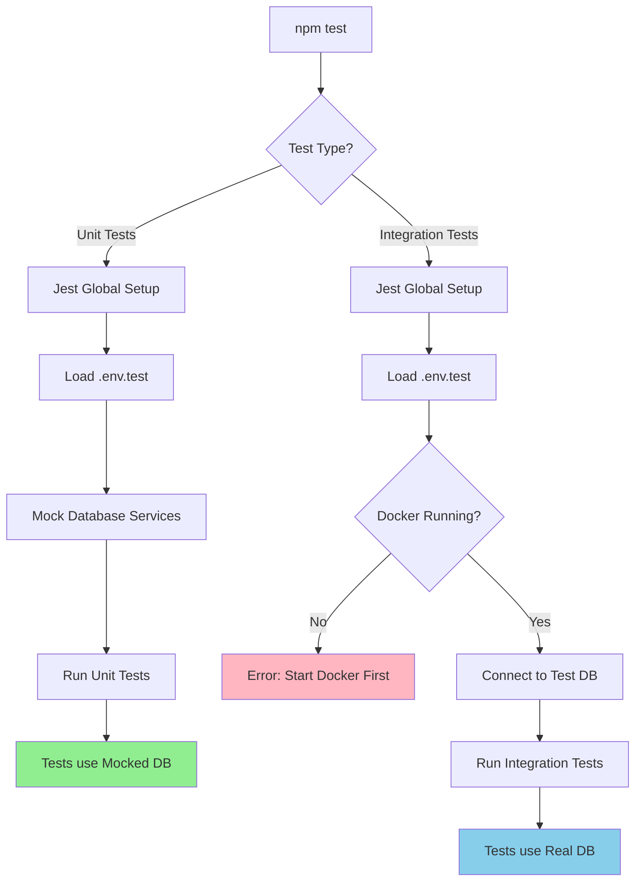
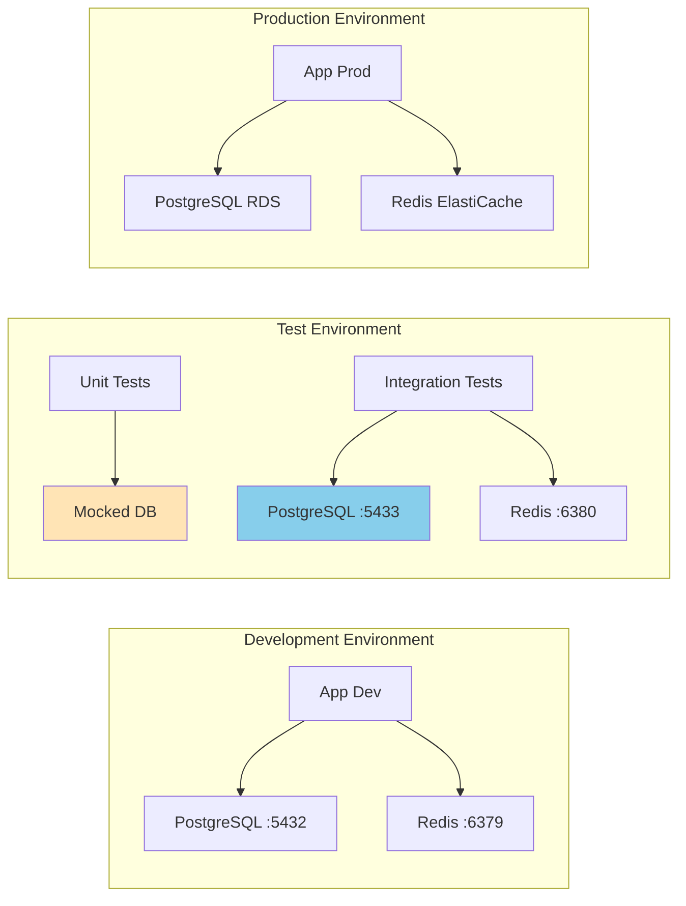
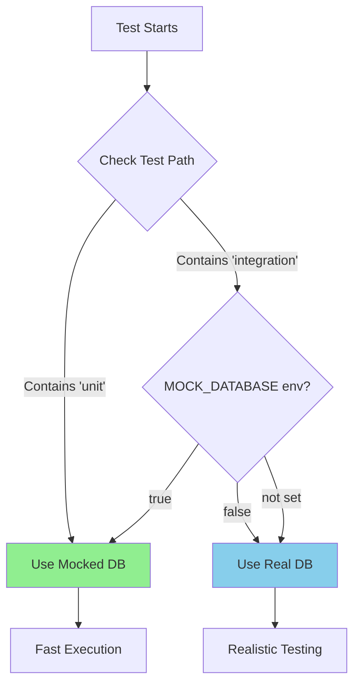
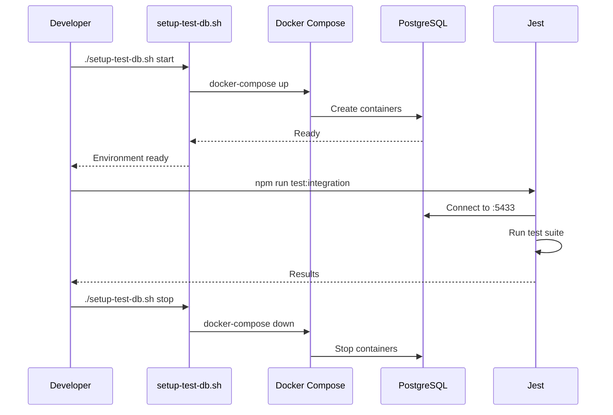
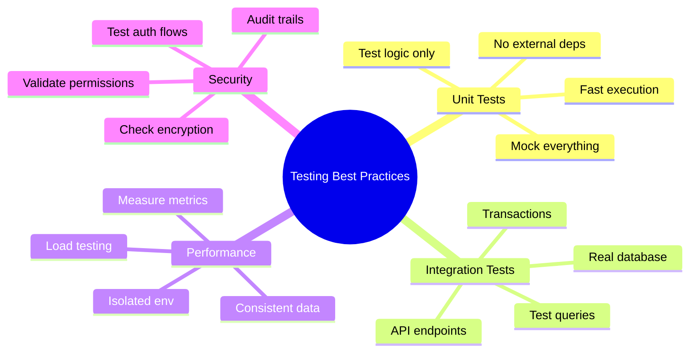
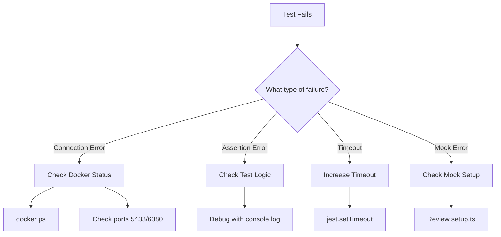

# OmniCare Backend Test Architecture

## Test Execution Flow



## Database Architecture



## Test File Organization

```
backend/
├── src/                    # Application code
│   ├── controllers/
│   ├── services/
│   └── models/
│
├── tests/                  # Test code
│   ├── unit/              # Fast, mocked tests
│   │   ├── controllers/
│   │   ├── services/
│   │   └── models/
│   │
│   ├── integration/       # Real database tests
│   │   ├── api/          # API endpoint tests
│   │   ├── database/     # Direct DB tests
│   │   └── workflows/    # End-to-end flows
│   │
│   ├── setup.ts          # Test environment setup
│   ├── global-setup.ts   # Jest pre-test setup
│   └── global-teardown.ts # Jest post-test cleanup
│
├── scripts/
│   ├── setup-test-db.sh  # Database management
│   └── verify-test-db.ts # Connection verification
│
└── devops/
    └── docker/
        └── docker-compose.test.yml
```

## Mock vs Real Database Decision



## Port Allocation Strategy

| Service | Development | Test | Production |
|---------|-------------|------|------------|
| PostgreSQL | 5432 | 5433 | RDS Managed |
| Redis | 6379 | 6380 | ElastiCache |
| API Server | 3000 | 8080 | 443 |

## Test Lifecycle



## Best Practices Visualization



## Common Workflows

### 1. TDD Development Flow
```bash
# Write failing test → Make it pass → Refactor
npm run test:watch -- path/to/new-feature.test.ts
```

### 2. Pre-Commit Flow
```bash
npm run test:unit        # Fast check
npm run test:integration # Thorough check
npm run test:coverage    # Ensure coverage
```

### 3. CI/CD Pipeline Flow
```
1. Checkout code
2. Install dependencies
3. Start test database (Docker)
4. Run all test suites
5. Generate coverage report
6. Stop test database
7. Deploy if passing
```

## Debugging Test Issues

